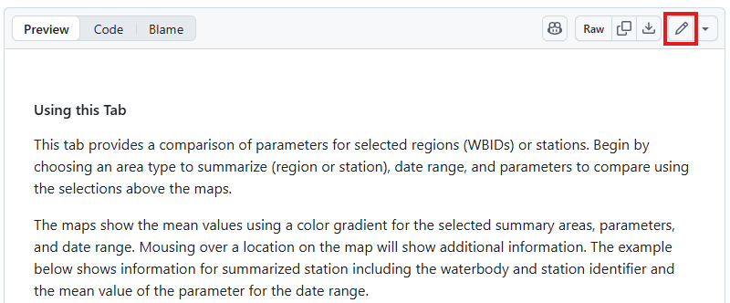
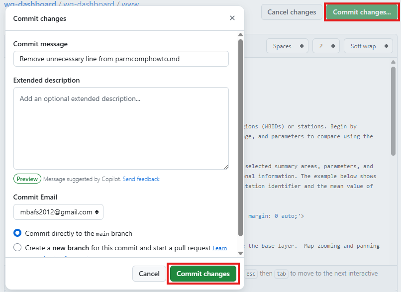

# Updating the dashboard

This document describes how to update the CBA water quality dashboard, including adding new data, deploying the dashboard to [shinyapps.io](https://basinalliance.shinyapps.io/wq-dashboard/), and updating documentation. 

## Updating data and redeploying the dashboard

The wq-dashboard repository that hosts the source code for the dashboard includes an automated workflow that uses GitHub Actions to update data and redeploy the dashboard.  This action can be run manually each to accomplish these tasks. 

To run the update worklfow, complete the following steps. 

1. Make any changes to the source data on Google Drive.  Note that the data structure and file names cannot change when updating data, otherwise the update process will likely fail. 
1. Navigate to [Actions](https://github.com/choctawhatchee-basin-alliance/wq-dashboard/actions) -> [data-build](https://github.com/choctawhatchee-basin-alliance/wq-dashboard/actions/workflows/data-build.yaml) on the main repository page.
1. On the right side of the page, you will see a button that says "Run workflow".  Clicking the button will open a dropdown menu with a green button for "Run workflow".  Click this green button to initiate the update.  

1. You will see a new "data-build" process initiate after a few seconds on the workflow runs menu.  You can click on the process to view the update progress. The update should only take about 10 or 15 minutes, but sometimes can take longer if the system or R dependencies are updating. 

1. If the update is successful, you will see a green check next to the process when it is complete.  You will see a red x if it fails.  You can examine the build details to see where the process failed.  Sometimes rerunning the workflow will fix the issue, but failures may also occur if the data import steps require attention.  In the latter case, please email [mbeck@tbep.org](mailto:mbeck@tbep.org) for troubleshooting. 

Briefly, the update workflow installs the necessary system and R dependencies, imports and updates the data from Google Drive by running the script [prep/dat_proc.R](https://github.com/choctawhatchee-basin-alliance/wq-dashboard/blob/main/prep/dat_proc.R), deploys the dashboard to [shinyapps.io](https://basinalliance.shinyapps.io/wq-dashboard/), commits any data changes to the main repository, runs [tests](https://github.com/choctawhatchee-basin-alliance/wq-dashboard/blob/main/doc/tests.md) to verify the updated data do not have any issues, and runs cleanup steps to complete the workflow.

## Updating documentation

All documentation on the dashboard is included in the folder [wq-dashboard/www](https://github.com/choctawhatchee-basin-alliance/wq-dashboard/tree/main/wq-dashboard/www).  The file names should indicate which file corresponds to which section on the dashboard, e.g., [overview.md](https://github.com/choctawhatchee-basin-alliance/wq-dashboard/blob/main/wq-dashboard/www/overview.md) includes the content for the dashboard landing page. 

The files are written in markdown, which includes a mix of markdown syntax, HTML, and plain text.  Do not modify any of the markdown syntax or HTML unless you want to change the appearance of the text. 

To modify a file, click on the file in the menu to view its content.  You'll see the file rendered as it would on the dashboard.  Click the pencil icon on the top right to edit. The file will then open in its "raw" format showing the text, markdown syntax, and HTML.  

Make any necessary changes and then select "Commit changes..." from the top right. A small window will pop up prompting you for a commit message.  Provide a brief description of what you changed, e.g., "update text in how to file".  Click "Commit changes" on the bottom when you are done. This will create a log of the changes in the version control history for the repository.

After updating any of the files, you will need to deploy the changes to the dashboard on shinyapps.io.  Simply follow the steps above to run the update and deployment workflow. 

