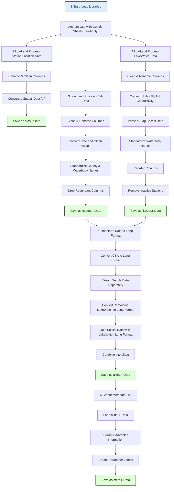

# Workflow Overview: R Script for Water Quality Data

<https://github.com/choctawhatchee-basin-alliance/wq-dashboard/blob/main/R/dat_proc.R>

---

## 1. Setup
- Load required libraries:  
  `tidyverse`, `googlesheets4`, `googledrive`, `sf`, `here`, `janitor`, `readxl`
- Authenticate Google Sheets access (read-only scope)
- Reference to shared Google Drive folder:  
  https://drive.google.com/drive/u/1/folders/1x51X6p60KOKpC3UEStIkuAWRhOH-8FHS

---

## 2. Load and Process Station Location Data

### **Data Source**
- Google Sheet ID: `13ob5pYoKnYMTMn-jqKFFT6e0QyrDPXmBK9QtcB0gnrw`

### **Steps**
- Read raw data from Google Sheet
- Swap Latitude and Longitude columns (they were mislabeled)
- Rename relevant columns (e.g., `CBA Waterbody Name` → `waterbody`)
- Convert WBID to unlisted format and station to character type
- Convert to spatial data with WGS84 CRS (EPSG:4326)
- Save processed station data to: `data/stas.RData`

---

## 3. Load and Process CBA Data (Physical Parameters)

### **Data Source**
- Google Sheet ID: `16_B7XLMDDgL-4RDz4UaFE4Gk569tYi2xaf1f96mAauY`
- Using '.' as NA values in the import

### **Steps**
- Read raw data
- Clean column names with `janitor::clean_names()`
- Rename key columns for clarity using detailed mappings:
  - `water_body` → `waterbody`
  - `station_number` → `station`
  - `date_month_day_year` → `date`
  - `temperature_surface_f` → `temp_surf_f`
  - `dissolved_oxygen_percent_surface_percent_sat` → `do_surf_psat`
  - `specific_conductivity_m_s_cm_surface` → `cond_surf_mscm`
  - and many more parameters for both surface and bottom readings
- Convert date strings to `Date` objects
- Convert station IDs to character type
- Standardize county names (e.g., `okaloosa` → `Okaloosa`)
- Standardize waterbody names using multiple `gsub()` replacements
- Drop redundant date/time columns (month, day, year, time)
- Save processed data as `cbadat` (no explicit file saving in this section)

---

## 4. Load and Process LakeWatch Data (Nutrients)

### **Data Source**
- Google Sheet ID: `1h4yvi9AnISVFbH_AvBw7wDx7s5-4VIOdqD-VToExmvg`
- Using 'NA' and empty string as NA values in the import

### **Steps**
- Read raw data
- Load list of inactive stations from `data-raw/Lakewatch inactive_KW.xlsx`
- Clean column names
- Rename columns for clarity (e.g., `lake` → `waterbody`)
- Convert total phosphorus (TP) and total nitrogen (TN) units from µg/L to mg/L (dividing by 1000)
- Handle conductivity unit conversion (µS/cm → mS/cm) where needed
- Parse and extract `secchi_ft` values from notes where necessary
- Flag if Secchi depth hit bottom or weeds (using Boolean true/false)
- Standardize waterbody names
- Reorder columns for readability (county, waterbody, station, date, then everything else)
- Remove inactive stations using anti-join with the loaded inactive stations list
- Filter out specific problematic data point (Campbell lake station 2 Deep)
- Save processed data as `lkwdat` (no explicit file saving in this section)

---

## 5. Transform Data to Long Format

### **Data Sources**
- Previously processed datasets:
  - `cbadat` (CBA physical data)
  - `lkwdat` (LakeWatch nutrient data)

### **Steps**
- Convert CBA data to long format using `pivot_longer()`
  - Keep county, waterbody, station, and date as identifier columns
  - Convert all other columns to variable-value pairs
  - Separate variable names into parameter, location, and units components
  - Add empty notes column (NA_character_)
- Process Secchi data separately for LakeWatch
  - Extract secchi_ft and secchi_onbott into a dedicated dataframe
  - Convert secchi_onbott boolean to 'on bottom' text in notes column
  - Create parameter column with value 'secchi'
  - Keep only unique secchi records
- Convert remaining LakeWatch data to long format using `pivot_longer()`
  - Keep county, waterbody, station, and date as identifier columns
  - Convert all other columns to variable-value pairs
  - Separate variable names into parameter and units components
  - Add location column with value 'surface' to all records
  - Join back the secchi data notes using left_join
- Combine both datasets into a nested list structure called `alldat`:
  - Nested by type (physical and discrete)
  - Each type contains the respective long-format dataset
- Save combined data as `alldat.RData` to: `data/alldat.RData`

---

## 6. Create Metadata File

### **Data Source**
- Previously saved `alldat.RData` (loaded using `data("alldat")`)

### **Steps**
- Extract unique combinations of type, units, location, and parameter from `alldat`
- Create human-readable labels for each parameter using `case_when()`:
  - `temp` → 'Temperature (F)'
  - `do` with units 'psat' → 'Dissolved Oxygen (% Sat)'
  - `do` with units 'mgl' → 'Dissolved Oxygen (mg/L)'
  - `cond` → 'Conductivity (mS/cm)'
  - `sal` → 'Salinity (ppt)'
  - `ph` → 'pH (su)'
  - `turb` → 'Turbidity (NTU)'
  - `secchi` → 'Secchi Depth (ft)'
  - `chlcorr` → 'Chl-a (ug/L, corrected)'
  - `chluncorr` → 'Chl-a (ug/L, uncorrected)'
  - `tp` → 'Total Phosphorus (mg/L)'
  - `tn` → 'Total Nitrogen (mg/L)'
  - `color` → 'Color (pt-co)'
  - `depth` → 'Depth (ft)'
- Save processed metadata as `meta.RData` to: `data/meta.RData`
