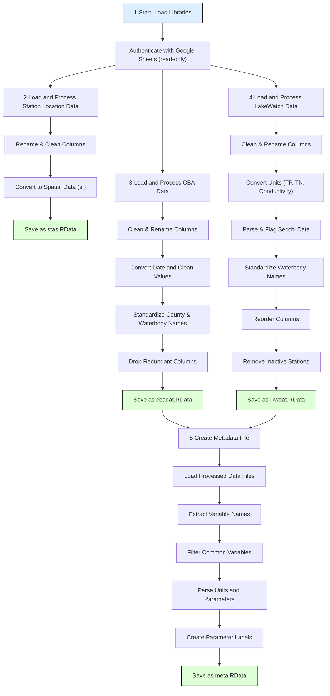

# Workflow Overview: R Script for Water Quality Data

<https://github.com/choctawhatchee-basin-alliance/wq-dashboard/blob/main/R/dat_proc.R>

---

## 1. Setup
- Load required libraries:  
  `tidyverse`, `googlesheets4`, `googledrive`, `sf`, `here`, `janitor`
- Authenticate Google Sheets access (read-only scope)
- Reference to shared Google Drive folder:  
  https://drive.google.com/drive/u/1/folders/1x51X6p60KOKpC3UEStIkuAWRhOH-8FHS

---

## 2. Load and Process Station Location Data

### **Data Source**
- Google Sheet ID: `13ob5pYoKnYMTMn-jqKFFT6e0QyrDPXmBK9QtcB0gnrw`

### **Steps**
- Read raw data from Google Sheet
- Swap Latitude and Longitude columns (they were mislabeled)
- Rename relevant columns (e.g., `CBA Waterbody Name` → `waterbody`)
- Convert to spatial data with WGS84 CRS
- Save processed station data to: `data/stas.RData`

---

## 3. Load and Process CBA Data (Discrete Physical)

#### **Data Source**
- Google Sheet ID: `16_B7XLMDDgL-4RDz4UaFE4Gk569tYi2xaf1f96mAauY`

#### **Steps**
- Read raw data
- Clean column names with `janitor::clean_names()`
- Rename key columns for clarity (e.g., `temperature_surface_f` → `temp_surf_f`)
- Convert date strings to `Date` objects
- Standardize names in `county` and `waterbody` columns using `case_when()` and `gsub()`
- Drop unneeded date/time columns
- Save processed data as `cbadat` to: `data/cbadat.RData`

---

## 4. Load and Process LakeWatch Data (Nutrients)

### **Data Source**
- Google Sheet ID: `1h4yvi9AnISVFbH_AvBw7wDx7s5-4VIOdqD-VToExmvg`

### **Steps**
- Read raw data
- Clean column names
- Rename columns for clarity (e.g., `tp_mg_l` → `tp_mgl`)
- Convert total phosphorus (TP) and total nitrogen (TN) units from µg/L to mg/L
- Harmonize conductivity values (µS/cm → mS/cm)
- Parse and extract `secchi_ft` values from notes where necessary
- Flag if Secchi depth hit bottom or weeds
- Standardize waterbody names
- Reorder columns for readability
- Remove inactive stations from `data-raw/Lakewatch inactive_KW.xlsx`
- Save processed data as `lkwdat` to: `data/lkwdat.RData`

---

## 5. Create Metadata File

### **Data Sources**
- Previously processed datasets:
  - `cbadat.RData` (CBA physical data)
  - `lkwdat.RData` (LakeWatch nutrient data)

### **Steps**
- Load the processed CBA and LakeWatch datasets
- Create a list containing variable names from both datasets, labeled by type:
  - `physical` for CBA variables
  - `discrete` for LakeWatch variables
- Convert list to a dataframe with columns for type and variable name
- Filter out common identification variables (county, waterbody, station, date, secchi_onbott)
- Extract measurement units from variable names using regex
- Determine measurement location (surface or bottom) based on variable names
- Extract parameter names from variable names
- Create human-readable labels for each parameter (e.g., `temp_surf_f` → `Temperature (F)`)
- Save processed metadata as `meta.RData` to: `data/meta.RData`

---

## 6. Questions

- Need waterbody, station location for Lakewatch data
- Waterbody, station as unique identifier?
- Multiple lakewatch waterbody, station values not in CBA data
- A few CBA waterbody, station values not in station metadata
