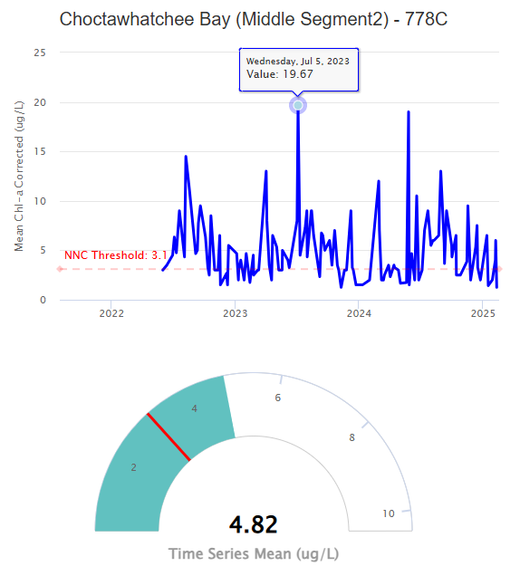

<h4 style = 'text-align: center'>Using this Tab</h4>

This tab provides a summary of individual parameters by region (WBID, Florida Department of Environmental Protection Waterbody ID) or station for a date range and sampling location (surface or bottom, if available). Begin by choosing a summary type, parameter, sample location, and date range of interest.

The map on the right shows the mean value of the parameter for the selection summarized by sampling stations within each WBID or station. The colors on the map show the relative mean values for the selection to quickly assess relative differences. Mousing over a WBID or station on the map will show additional information. The example below shows information for a WBID summary including the WBID identifier, the number of stations in the WBID used to summarize the parameter, and the average value of the parameter for the date range and sample location (if available).

 
   
 

The controls on the map can also be used to zoom in or change the base layer. Map zooming and panning can also be done using the mouse.

   
 

Clicking a WBID or station on the map will highlight the selection and open the far right tab showing additional information. A time series plot for the summarized WBID or single station and a gauge plot showing the overall mean of the time series in the selection are shown.  If available, relevant numeric nutrient criteria (NNC) are also shown on the plot and gauge as red lines. Note that these values are provided as reference only and cannot be used for regulatory assessment. Mousing over the plot will show additional information for the date and value at that point in the time series.

   
 

The hamburger icon on the top right of each plot can be used to view the plot in full screen, download the plot as a png, or download the plot data as a csv.

Sub-tabs can be expanded or minimized by clicking the arrows on the top right.

