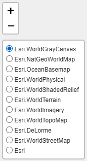

<h4 style = 'text-align: center'>Using this Tab</h4>

This tab provides a summary of continuous monitoring data at select stations for a chosen parameter and date range. Begin by choosing a parameter and date range of interest.

The map on the right shows the mean value of the parameter across the date range for the stations with continuous data. The colors on the map show the relative mean values for the selection to quickly assess relative differences. Mousing over a station on the map will show additional information. The example below shows information for a station summary including the waterbody and station identifier and the mean value of the parameter for the date range.

 
   
 

The controls on the map can also be used to zoom in or change the base layer. Map zooming and panning can also be done using the mouse.

   
 

Clicking a station on the map will highlight the selection and open the far right tab showing additional information. A time series plot for the station and a gauge plot showing the overall mean of the time series in the selection are shown. Mousing over the plot will show additional information for the date and value at that point in the time series.

   
 

The time series plot can also be summarized by means for different time periods. Available options are none (no summary), day, week, month, quarter, or year. Confidence intervals (95%) are provided for the summary time period if "none" is not selected. A trend line showing the linear fit to the data can also be included by clicking the option on the top right.

Sub-tabs can be expanded or minimized by clicking the arrows on the top right.

