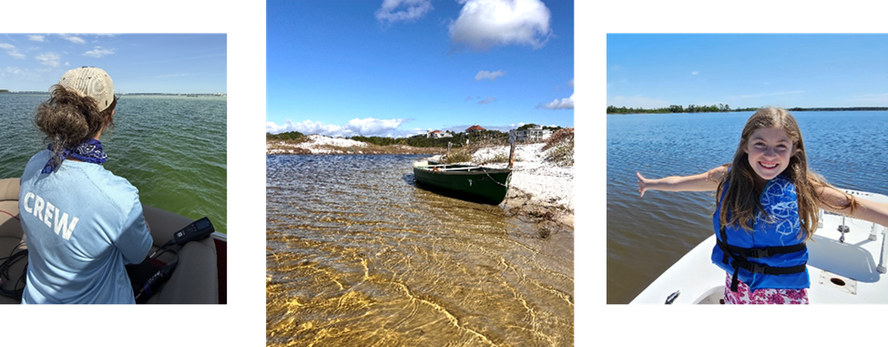

<h4>CBA Water Quality Monitoring</h4>
 

  
 

* <b>Monthly Monitoring</b>
* 140+ stations are monitored each month.
* CBA began monitoring in 1996 and has incorporated some data collected as early as 1992! 
* New stations continue to be added to expand geographic reach in the watershed.
* Stations are monitored by CBA Staff and trained Citizen Scientists, our Water Science Crew.
* Parameters that are collected in the field:
  * Temperature 
  * Dissolved Oxygen 
  * Specific Conductivity 
  * pH
  * Salinity 
  * Turbidity 
  * Secchi Disk Vanishing Point
* Water samples are collected and analyzed by University of Florida's Florida LAKEWATCH Program for:
  * Total Phosphorus
  * Total Nitrogen
  * Chlorophyll- A
* Data from the monthly monitoring program are updated on the dashboard at least yearly and serve to establish water quality baselines and reveal long-term trends.
* <b>Continuous Monitoring Data is coming soon!</b> Continuous monitoring stations will collect data every 15 minutes and be streamed to the dashboard. These data will reveal real-time water quality, helping to bridge the gap between long-term trends and current conditions. 
* CBA also collects monthly <b>Red Tide</b> samples at 8 stations that are submitted to FWRI for analysis. A link to FWC’s Red Tide Program is linked in the Additional Resources tab.

<h4>Reference Lines</h4>

Several graphics on this dashboard include reference lines for Numeric Nutrient Criteria (NNC) for total phosphorus, total nitrogen, and chlorophyll-a. These reference lines vary by WBID and are based on 62-302.531, and 62-302.532, F.A.C. They are provided as reference only and cannot be used for regulatory assessments.

