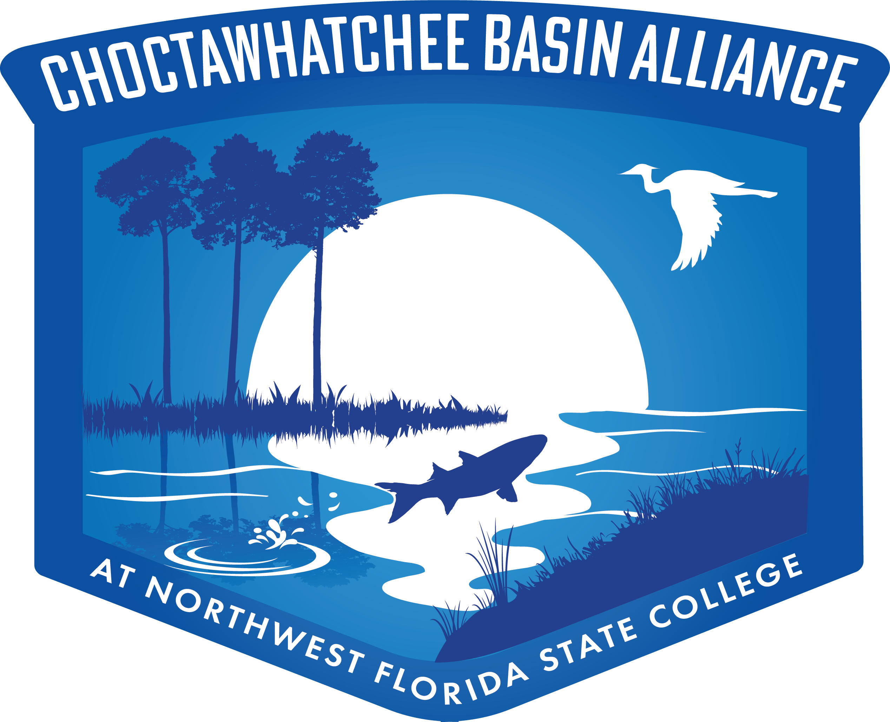
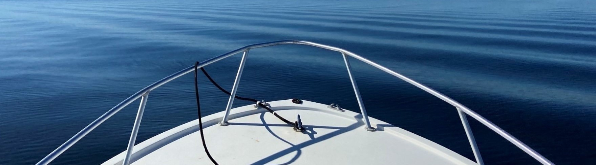

  
  <h2 style='margin: 0; flex: 1; text-align: center; font-size: clamp(0.9rem, 3vw, 1.8rem);'>
    WELCOME TO THE CHOCTAWHATCHEE&nbsp;BASIN&nbsp;ALLIANCE WATER QUALITY DASHBOARD!
  </h2>

 

  
 
           

The Choctawhatchee Basin Alliance (CBA) of Northwest Florida State College has been monitoring local waterways since its inception in 1996. Partnering with the University of Florida’s Florida LAKEWATCH program, CBA conducts monthly water quality monitoring at 140+ stations throughout the watershed, including Choctawhatchee Bay, the Choctawhatchee River, and Walton County coastal dune lakes. A dedicated team of citizen scientist volunteers - CBA’s Water Science Crew - assists CBA staff in data collection efforts.

This interactive dashboard presents CBA’s water quality data with several options for data summaries and visualization. Simply click the tabs at the top of the page to view:

 
* <b>By Area</b>: data for a specific region (WBID) or station are displayed once selected on the map
* <b>Parameter Comparison</b>: visually compare the results of multiple parameters at once
* <b>Download</b>: download monthly water quality data by filtering for waterbody, parameter, and date of interest
* <b>Oyster Habitat Suitability</b>: explore the suitability of different regions of Choctawhatchee Bay for the Eastern Oyster, <i>Crassostrea virginica</i> based on water quality, substrate, and other factors and analysis
* <b>Additional Resources</b>: links to other local environmental programs

The first three tabs contain a "How To Use"" pane with instructions for how to interact with the data within those tabs.

<h4 style = 'text-align: center;'>Dashboard Info</h4>

The page source content can be viewed on <a href='https://github.com/choctawhatchee-basin-alliance/wq-dashboard' target='_blank'>Github</a>. Questions and comments about the dashboard can be sent to <a href="mailto:wingardk@nwfsc.edu">Kayla Wingard</a> or <a href="mailto:mbeck@tbep.org">Marcus Beck</a>.

&nbsp;&nbsp;This website is licensed under a <a rel='license' href='http://creativecommons.org/licenses/by/4.0/' target='_blank'>Creative Commons Attribution 4.0 International License</a>.

