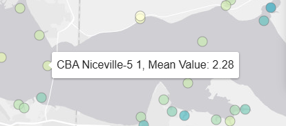
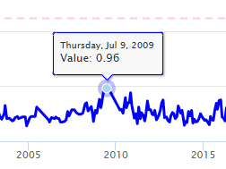

<h4 style = 'text-align: center'>Using this Tab</h4>

This tab provides a comparison of parameters at the same location. Begin by choosing a date range and parameters to compare using the selections above the maps.

The maps show the mean values using a color gradient for the selected parameters and date range. Mousing over a station on the map will show additional information. The example below shows information for summarized station including the waterbody and station identifier and the mean value of the parameter for the date range.

 
   
 

The controls on the map can also be used to zoom in or change the base layer.  Map zooming and panning can also be done using the mouse.

   
 

Clicking a station on the map will highlight the selection and open the far right tab showing additional information. A station selected on one map will also be highlighted on the other map. A time series plot for the selected station will appear on the far right, showing values for the two parameters in the maps. Values for the left map are shown on the top and values for the right map are shown on the bottom. If available, relevant numeric nutrient criteria (NNC) are also shown on the plots as red lines. Note that these values are provided as reference only and cannot be used for regulatory assessment. Mousing over the plot will show additional information for the date and value at that point in the time series.

   
 

The time series plot can also be summarized by means for different time periods. Available options are by day or year. Confidence intervals (95%) are provided for the time period if year summaries are selected. A trend line showing the linear fit to the data can also be included by clicking the option on the top right.

Sub-tabs can be expanded or minimized by clicking the arrows on the top right.

